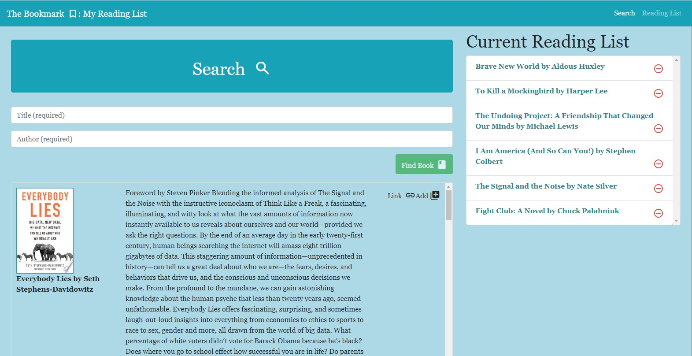
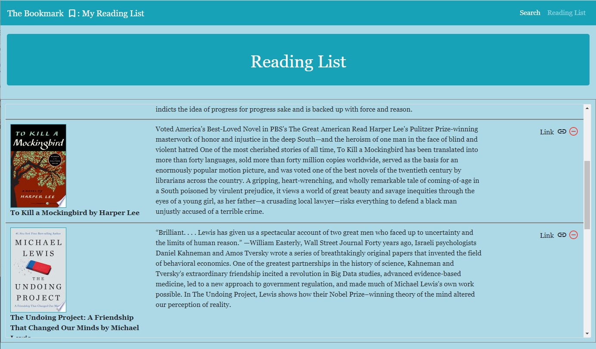
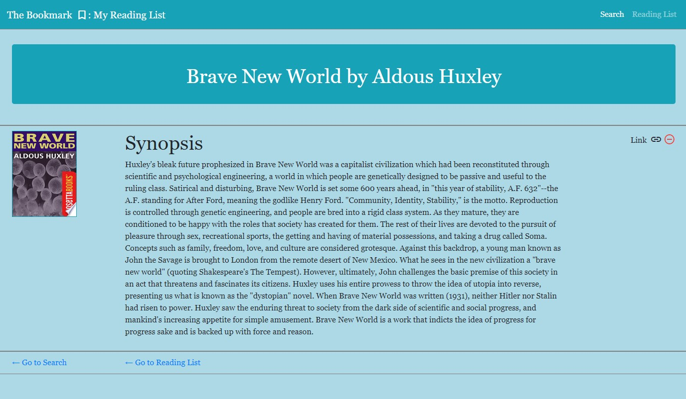

# The Bookmark: My Reading List

A full stack web application that allows a user to search for books by title and author and save books they would like to read to their reading list.

### [Link to site](https://booksapp-lh.herokuapp.com/)

### Usage

On the search page input a title and author to search for a book on the Google Books API.  The search returns the top ten matches with a thumbnail of the cover, the author, synopsis, a link to buy the book on  Google Play and a button to add the book to the reading list.  The search page displays the current reading list.  Click on a title in the reading list to navigate to the details of the book or click on the remove button to remove from the  reading list.  Click on the "Reading List" tab on the navigation bar to view a more detailed reading list with thumbnail of the cover, synopsis and a link to the book on Google Play.

### Reading List

### Book Details

### Built with

* Node.js - runtime environment
* Express.js - server framework for Node.js
* React - user interface components and state control
* MongoDB - NoSQL database
* Axios NPM - Handling HTTP requests
* node-google-books-search-promise - NPM for searching Google Books API
* Mongoose ODM - Object model/Controllers
* Materialize.CSS - styling and page layout

